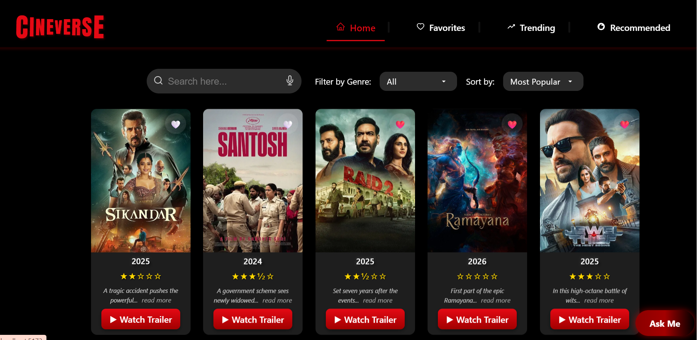
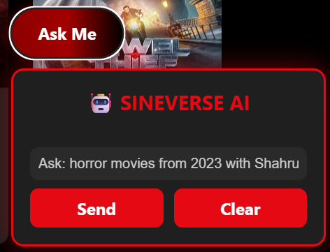
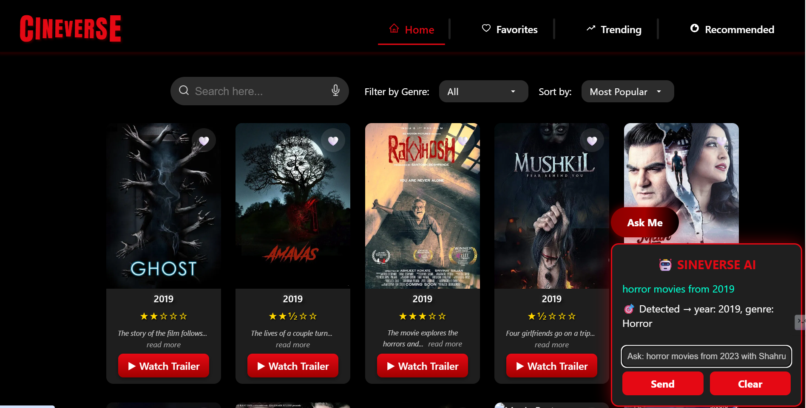
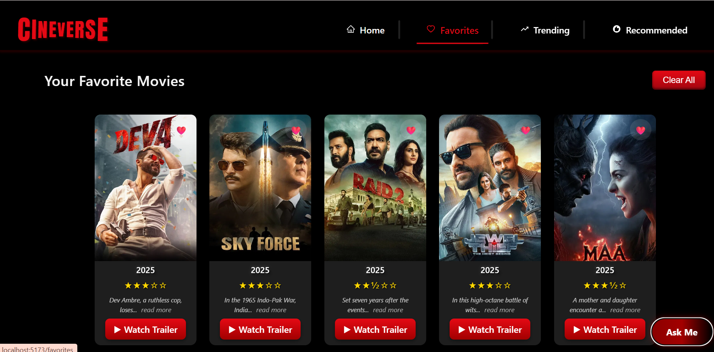

# 🎬 SINEVERSE AI – Conversational Movie Search Website with AI-Inspired Filtering & Speech Recognition

A unique AI-powered React movie platform that lets users search for movies using natural language voice or text queries — just like chatting with an assistant!

Instead of using typical filters and dropdowns, this project uses Named Entity Recognition (NER) via Hugging Face Transformers to understand context like actor names, genres, years, and ratings — making it one of the few front-end movie apps to offer conversational filtering.


## 🔗 Project Links
- **Live Demo**: [Cineverse AI – Live Demo](https://cineverse-ai-movie-search.netlify.app/)
- **GitHub Repository**: [https://github.com/LavanyaT809/Cineverse-Ai-Movie-Web](https://github.com/LavanyaT809/Cineverse-Ai-Movie-Web)

## 🧰 Built With


 


## 📸 Screenshots

<div align="center">

<!-- Homepage -->
<p><strong>🏠 Homepage</strong><br/>
Displays trending and recommended movies with a clean card layout.</p>


<br/><br/>

<!-- AI Chatbot -->
<p><strong>🤖 AI Chatbot Filtering</strong><br/>
Natural language queries processed via Hugging Face NER model.</p>


<br/><br/>

<!-- Prompt Example -->
<p><strong>🗣️ Prompt Example</strong><br/>
Example query like: <em>"horror movies from 2019"</em>.</p>


<br/><br/>

<!-- Voice Search -->
<p><strong>🎙️ Voice Search</strong><br/>
Use microphone to search movies using voice commands.</p>


<br/><br/>

<!-- Favorites -->
<p><strong>❤️ Favorites Section</strong><br/>
Easily add or remove favorite movies.</p>


</div>


## 🚀 Features
🧠 Unique & Smart Features (USP)

•	Voice Search using Web Speech API – search movies without typing

•	AI-Powered Chatbot using Hugging Face NER – extract actor, genre, year, rating from natural text like “thriller movies with SRK from 2023”

•	Speech Output – results are read aloud using SpeechSynthesis 

•	Conversational Filtering – mimics smart chatbot experience without using backend logic

•	Frontend-only AI Integration – Hugging Face & Web APIs used directly in browser

✅ Common Features

• Genre & Sort Filters – filter by popularity, rating,genre and release year

• Favorites – add or remove movies from a favorites list

• Pagination Controls – navigate through multiple pages of movie results

• Responsive Design – optimized for all screen sizes using CSS Flexbox

• Live Movie Data – fetched in real-time from the TMDB API

• Dynamic Pages – includes Trending, Recommended, Favorites, and Bollywood sections

• Animated Movie Cards – smooth fade-in animations for a polished user experience


## 🛠️ Tech Stack
| Layer        | Technologies Used                                                                          |
| ------------ | ------------------------------------------------------------------------------------------ |
| **Frontend** | React.js, JavaScript (ES6+), HTML5, CSS3                                                   |
| **Styling**  | Custom CSS (modular per page/component), Flexbox, Responsive Web Design                    |
| **AI / ML**  | Hugging Face Transformers – `dbmdz/bert-large-cased-finetuned-conll03-english`             |
| **API**      | TMDB API – The Movie Database API for real-time movie data                                 |
| **Speech**   | Web Speech API – for both **voice input** (speech-to-text) and **output** (text-to-speech) |
| **Build**    | Vite.js – Fast development server and bundler                                              
| **Deploy**   | GitHub Pages / Netlify (Recommended for frontend projects) 

## 🧠 Why I Built This
I wanted to go beyond a typical CRUD-based React project and explore how client-side apps can feel intelligent, accessible, and  user-friendly. Instead of relying on just clicks and inputs, I integrated voice search, speech output, and AI-powered filtering to mimic a chatbot-like assistant — all without a backend. This project focuses on accessibility and natural interaction, showing how even frontend-only apps can deliver intelligent, user-friendly experiences.
## 🚀 Getting Started 
From setup to launch in minutes!

📦 Prerequisites

- Node.js (v16+ recommended)

- npm or yarn installed

- TMDB API key (Free — get from [TMDB](https://www.themoviedb.org/))

- Hugging Face API Key (Free tier — get from [Hugging Face](https://huggingface.co/))


📥 Installation Steps

Follow these steps to set up the project locally:

```bash
 1. Clone the repository
git clone https://github.com/yourusername/project-name.git

 2. Navigate into the project folder
cd project-name

 3. Install dependencies
npm install

 4. Create a .env file in the root and add your API keys
 Example:
 VITE_HUGGINGFACE_API_KEY=your_huggingface_key_here

 5. Start the development server
npm run dev
```


🌐 Access the Web
After running npm run dev, open:

http://localhost:5173/

## 📁 Project Structure
├── public/ # Static assets (icons, logos)

├── src/

│ ├── assets/ # Static resources (CSS, images)

│ │ └── components/ # Reusable UI components (e.g., MovieCard, Navbar)

│ ├── pages/ # Main page components (Home, Trending, Bollywood)

│ ├── services/ # API logic (TMDB API, Hugging Face integration)

│ ├── App.jsx # Main app routing and layout

│ └── main.jsx # Entry point (React + Vite setup)

├── .env # Environment variables (API keys)

├── package.json # Project metadata & dependencies

└── README.md # Project overview


## 🔐Environment variables

Before running the project, create a `.env` file in the root directory and add the following keys:

```bash
VITE_TMDB_API_KEY=your_tmdb_key_here  
VITE_HUGGINGFACE_API_KEY=your_huggingface_key_here
```


## 🔭 Future Scope

- Chatbot Upgrade: Integrate a full conversational chatbot using LLMs (like OpenAI or Gemini) for more natural movie queries.

- Movie Trailers & Watchlist: Add trailer previews, watchlist functionality, and real-time availability from streaming platforms.

- Analytics Dashboard: Track most searched genres, actors, and popular filters using basic frontend analytics.

- Multi-language Support: Expand accessibility with support for voice search in multiple Indian languages.


## 📚 What I Learned
✅ Technical Learnings
- Gained hands-on experience with React fundamentals like state, props, effects, and component structuring.

- Integrated real-world APIs (TMDB & Hugging Face), handled dynamic queries, and processed async data in the UI.

- Implemented voice input/output using Web Speech API, and connected AI-driven NER model for contextual filtering.

- Built responsive UI using Flexbox and custom CSS with animation and accessibility in mind.

- Debugged edge cases such as API inconsistencies, subword tokens, and filter conflicts — improving problem-solving skills.

💡 Non-Technical Learnings
- Improved persistence and debugging through real-world issues with third-party APIs.

- Focused on user-first thinking by making the app feel more interactive, accessible, and assistant-like.

- Strengthened ability to read technical documentation and apply it effectively.


## 🤝 Contributing
Contributions are welcome and appreciated! For major changes open an issue first to discuss what would you like to change.
## 💬 Support
For general queries, suggestions, or feedback, you can connect with me on [LinkedIn](https://www.linkedin.com/in/lavanya-tuptewar).

## 📜 License
This project is licensed under the [MIT License](LICENSE).
